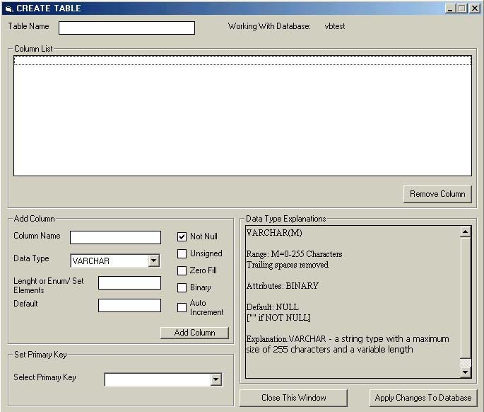



## MySQL Database Manager

### Description

This code makes easy the creation of databases and tables in a MySQL Server.
 
### More Info
 
You need a MySQL Server running anywhere with admin priviledges and MyODBC 3.51.

             |
---                |---
**Submitted On**   |2003-01-29 03:29:58
**By**             |[José M\. Nieves](https://github.com/Planet-Source-Code/PSCIndex/blob/master/ByAuthor/jos-m-nieves.md)
**Level**          |Intermediate
**User Rating**    |4.8 (19 globes from 4 users)
**Compatibility**  |VB 6\.0
**Category**       |[Databases/ Data Access/ DAO/ ADO](https://github.com/Planet-Source-Code/PSCIndex/blob/master/ByCategory/databases-data-access-dao-ado__1-6.md)
**World**          |[Visual Basic](https://github.com/Planet-Source-Code/PSCIndex/blob/master/ByWorld/visual-basic.md)
**Archive File**   |[MySQL\_Data1536211292003\.zip](https://github.com/Planet-Source-Code/jos-m-nieves-mysql-database-manager__1-42783/archive/master.zip)

